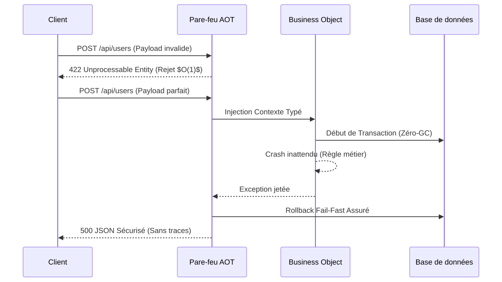

[English](README.md) | [Français](README.fr.md)

# Espace de travail LightX (Node.js)


-orange>)


**LightX** est un framework Node.js et TypeScript "Extreme Bare-Metal" conçu pour la mise en production d'entreprise. Il repose sur une approche **Database-First** stricte et une philosophie **Zéro-Overhead** (aucune perte de performance logicielle ni surcharge de la machine virtuelle V8).

Au lieu de rédiger du code de validation fastidieux, LightX inspecte votre base SQL et déduit dynamiquement l'architecture de votre serveur backend via un compilateur **Ahead-Of-Time (AOT)**. Vos modèles métiers, routeurs mathématiques, et pare-feux de validation json sont générés à la compilation.

---

## Les 3 Piliers du Framework (Rappel)

Pour comprendre LightX, il suffit d'intégrer le rôle de ses 3 différentes couches :

<div align="center">
  
</div>

### 1. DAO (Data Access Object)

Généré algorithmiquement en amont via `@soysouvanh/daox`. Il fabrique des structures TypeScript 100% sécurisées. Fini la pollution du dépôt avec du code redondant, et fini les exceptions SQL silencieuses à l'exécution !

### 2. AOP (Programmation Orientée Aspect)

Vos chemins et contraintes d'API sont calculés statiquement. LightX compile un routeur "Pare-feu" mathématiquement infaillible pour bloquer toute donnée malveillante entrante au coût strict $O(1)$. Il prémunit nativement votre infrastructure contre les attaques _Prototype Pollution_, l'épuisement de Stack (_JSON Max Depth_), et les crashs OOM (_Out Of Memory_).

### 3. BO (Business Object)

C'est le bunker. Le lieu de travail de vos ingénieurs. Solidement protégé par le pare-feu AOT, votre code métier ne réceptionnera et ne manipulera que des données irréprochables et conformes.

---

## Gestion des Erreurs Infaillible (Panic-Free)

<div align="center">
  
</div>

LightX est conçu pour absorber les crashs côté serveur. Les exceptions V8 liées aux manipulations de socket (EPIPE, Timeout) et les crashs logiciels applicatifs sont encapsulés hermétiquement.
Qu'il s'agisse d'un format de champ erroné (`422`) ou d'un algorithme métier paniquant (`500`), LightX convertit l'anomalie pour livrer sans rompre la boucle asynchrone V8, garantissant 0% d'arrêt de votre service.

---

## Cycle de Vie d'une Requête (Fonctionnement Pédagogique)

Pour comprendre LightX, il faut distinguer la magie automatique du code réel écrit par le développeur.

### Le Flux Détaillé de Bout en Bout (End-to-End)

1. **La Requête HTTP :** Le client envoie une requête vers votre instance SSL Node.
2. **Le Routeur Mathématique :** L'aiguilleur ultra-rapide trouve le bon gestionnaire en $O(1)$. Il limite les flux JSON via un streaming mémoire maîtrisé (Anti-DoS). Si c'est invalide, il déconnecte instantanément. Rien n'arrive jusqu'au Garbage Collector de Node.
3. **L'Injecteur (AOP) :** La requête saine déclenche le rassemblement des `GenericsExecutor` des bases de données de façon complètement non-polymorphique pour contrer la "Prototype Pollution".
4. **Le BO (Business Object) :** La seule fonction que VOUS avez écrite. Elle manipule la donnée pure (typée `$unknown` puis inferrée).
5. **Le DAO :** Accès performant aux données. Encapsulé sous le modèle **RAII** (Acquisition de ressource = Initialisation).
6. **La Réponse :** Le framework sérialise nativement votre sortie JSON, valide la libération de la transaction, et effectue un retour réseau.

---

## Que doit faire le développeur ?

Pour créer une nouvelle API fonctionnelle, le développeur Node.js n'a que **4 étapes simples** à suivre :

<br>
<div align="center">
  
</div>
<br>

1. **La Base (SQL) :** Créer la table dans la structure. L'introspecteur fera le reste.
2. **Les Surcharges (Overrides) :** Créez des règles de validation web au-dessus du schéma (ex: mot de passe qui n'est pas stoqué tel quel en DB, champ accept_terms).
3. **La Route :** Affecter les pointeurs de dépendances aux paramètres d'API demandés.
4. **Le Métier (TypeScript) :** Écrire la fonction de résolution (Pure) dans un simple fichier `src/bo/`.

## Compiler tout l'écosystème

Compilez de manière stricte le projet par les outils npm natifs (basés sur TypeScript Compiler & Node VM isolée) :

```bash
npm run build
```
