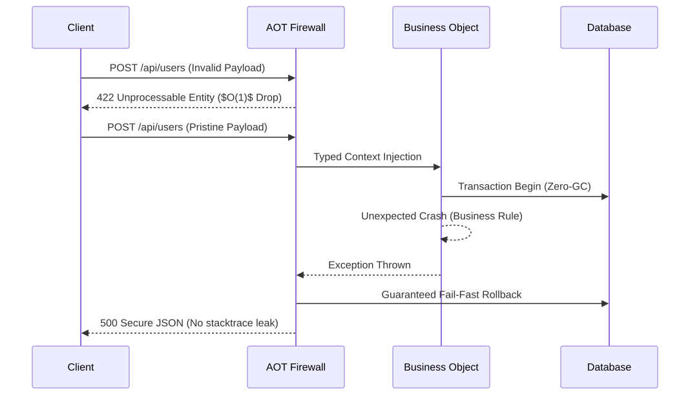

[English](README.md) | [Français](README.fr.md)

# LightX Workspace (Node.js)


-orange>)


**LightX** is an "Extreme Bare-Metal" Node.js and TypeScript framework engineered for enterprise production. It adheres to a strict **Database-First** approach and a **Zero-Overhead** philosophy (zero software performance loss and absolute V8 VM memory shielding).

Instead of writing tedious validation boilerplate, LightX transparently inspects your SQL database and dynamically deduces the entirety of your backend server architecture using an **Ahead-Of-Time (AOT)** compiler. Your business models, mathematical routing matrix, and JSON firewalls are natively generated out of the box.

---

## The 3 Pillars of the Framework

To understand LightX, you just need to embrace the roles of its 3 distinct layers:

<div align="center">
  
</div>

### 1. DAO (Data Access Object)

Algorithmically generated upfront via `@soysouvanh/daox`. It produces 100% robust and secure TypeScript structures. No more repository pollution with redundant code, and no more silent SQL injection exceptions at runtime!

### 2. AOP (Aspect-Oriented Programming)

Your API endpoints and constraints are calculated statically. LightX compiles a mathematically infallible "Firewall" router that intercepts and neutralizes malicious payload at $O(1)$ overhead cost. It natively immunizes your infrastructure against _Prototype Pollution_, Stack exhaustion (_JSON Max Depth_), and OOM crashes (_Mass Assignment_).

### 3. BO (Business Object)

This is the bunker. The workspace for your application engineers. Rock-solidly protected by the AOT firewall, your business code will solely receive mathematically verified and strictly typed payloads.

---

## Panic-Free Error Management

<div align="center">
  
</div>

LightX gracefully absorbs server-side crashes. V8 socket exceptions (EPIPE, drops) and application software crashes are strictly encapsulated.
Whether handling a wrong field schema (`422`) or an algorithmic panic (`500`), LightX parses the anomaly perfectly to cleanly yield standardized JSON without stalling your V8 asynchronous event loop.

---

## End-to-End Request Lifecycle

### Detailed Data Flow

1. **HTTP Request:** The client routes data into your SSL Node instance.
2. **Mathematical Router:** The ultra-fast pointer resolves the handler target in strict $O(1)$. It limits JSON streams in memory via tight boundaries (Anti-DoS). If invalid, connections are brutally dropped, starving the V8 Garbage Collector.
3. **AOP Injector:** Pristine requests trigger dynamic DB connection pooling securely mapping parameters. "Prototype pollution" is neutralized by isolating parsing scopes mathematically.
4. **The BO (Business Object):** The only function YOU wrote. Manipulating pure data.
5. **The DAO:** Performance-centric lazy abstraction for connections, strictly encapsulated inside the Resource Acquisition Is Initialization (**RAII**) paradigm.
6. **The Response:** The framework natively serializes your JSON objects on execution end and handles network buffer flushing.

---

## Developer Workflow

To create a brand-new API, Node.js developers only follow **4 easy steps**:

<br>
<div align="center">
  
</div>
<br>

1. **The Database (SQL):** Create your table in the DB. The code introspector handles everything else.
2. **Overrides:** Configure Web-specific rules on top of raw SQL schema (i.e. virtual `password` bounds, `accept_terms` checkbox requirements).
3. **The Route Setup:** Tell the handler which DB fields map to its expected inputs.
4. **The Code (TypeScript):** Simply craft a pure resolution function inside a single `src/bo/` file.

## Build the App

Strictly compile the whole architecture via local standard npm toolchain:

```bash
npm run build
```
