# @soysouvanh/tmplx

> **Le moteur de template AOT "Extreme Bare-Metal" conçu pour Node.js et TypeScript.**

<p align="center">
  
</p>

**Tmplx** redéfinit le rendu côté serveur (SSR). Au lieu d'analyser vos fichiers HTML à chaque requête HTTP (comme EJS, Pug ou Nunjucks), Tmplx agit comme un compilateur **AOT (Ahead-Of-Time)** pré-calculé.

Il transcode votre HTML en bibliothèques de tampons de mémoire statiques (Buffer `UTF-8`) encodés en dur dans du vrai code TypeScript.  
**Le résultat ?** Zéro analyse `Regex` à l'exécution, Zéro transcodage de chaîne `UTF-16` à `UTF-8`, et un contournement quasi complet du Garbage Collector (GC) de V8 pour repousser les limites de vos serveurs (OOM Evasion).

---

## Fonctionnalités clés et sécurité

- **Vitesse maximale** : Le HTML compilé est envoyé de la mémoire V8 directement vers `libuv` à la vitesse du C++.
- **Sécurité "Short-Circuit"** : Protection XSS native traitant l'échappement en `O(n)`.
- **Intégrité structurelle (I/O Guard)** : Résolution absolue contre le Path Traversal et les attaques Symlink. Interception à la compilation des références circulaires (`Billion Laughs`).
- **100% Zero-Dependency** : Repose intégralement sur l'API native `node:*`. Zéro gonflage du `node_modules`.

---

## Installation et prérequis

Tmplx s'installe au cœur de votre projet via NPM.  
**Note systémique :** Pour utiliser directement le code généré sans outil tiers (comme `ts-node`), nous utilisons les flags officiels de **Node.js v22.6.0** ou supérieur.

```bash
npm install @soysouvanh/tmplx
```

---

## Guide d'implémentation exhaustif (pas à pas)

Ce guide décrit la mise en place complète, la syntaxe exhaustive des templates, et la méthode de stream binaire finale.

### 1. Structurer son projet

Créez un dossier pour abriter vos modèles HTML. Par convention, tout fichier (ou dossier) commençant par un _underscore_ (`_`) sera traité comme un **fragment privé** (layout ou composant) et ne génèrera pas de point d'entrée public direct.

```text
mon-projet/
├── templates/
│   ├── _layout.html                  <-- Gabarit général (privé)
│   ├── _components/
│   │   └── user_card.html            <-- Composant réutilisable (privé)
│   └── users/
│       └── profile.html              <-- Vue requêtable (publique)
```

### 2. Syntaxe et fonctionnalités (avec exemples)

La syntaxe utilise des délimiteurs formels. Les variables que vous injectez depuis votre serveur Node seront toujours contenues dans l'objet `view_data`.

#### A. Héritage via les layouts (`extends` & `block`)

Permet de définir un patron de conception extensible pour garder un code DRY (Don't Repeat Yourself).
**Fichier `templates/_layout.html` :**

```html
<!DOCTYPE html>
<html>
  <head>
    <title>Titre par défaut</title>
  </head>
  <body>
    <header><h1>Application LightX</h1></header>
    <main></main>
  </body>
</html>
```

#### B. Injection de variables (PrintSafe `XSS` vs PrintRaw)

- `{%%= view_data.monTexte %}` : Échappe les caractères dangereux (>, <, &, ", '). C'est le **standard obligatoire**.
- `` : (RAW) Injecte le texte sans protection. À utiliser uniquement si le serveur garantit l'innocuité du code injecté.

#### C. Logique TypeScript pure et inclusions (`include`)

Il n'y a **pas de pseudo-langage** à apprendre. Les blocs de logique `` exécutent du JavaScript/TypeScript natif (conditions `if`, itérateurs `for...of`).
**Fichier `templates/_components/user_card.html` :**

```html
<div class="card">
  <h2>{%%= view_data.user.name %}</h2>

  <!-- Code TypeScript standard -->
  
  <span class="badge">Admin</span>
  

  <ul>
    <!-- Utilisation du tiret `{%-` pour supprimer les blancs/sauts de ligne -->
    
    <li>{%%= right %}</li>
    
  </ul>
</div>
```

#### D. L'entrée appellable

Assemblons le layout et le sous-composant.
**Fichier `templates/users/profile.html` :**

<!-- prettier-ignore -->
```html


Profil de {%%= view_data.user.name %}


<section>
  <!-- L'inclusion d'un sous-fichier cible le chemin relatif -->
  
</section>

```

---

## 3. Compilation avancée CLI (Ahead-Of-Time)

Maintenant, nous allons transformer ce texte HTML en Buffer TypeScript purement réseau.  
Tmplx fournit son constructeur natif (CLI).

Ouvrez un terminal dans votre projet et tapez :

```bash
npx @soysouvanh/tmplx build --in ./templates --out ./src/tmplx_generated.ts
```

> **Fonctionnement détaillé de la CLI :**
>
> - **`build`** : La commande directive unique de construction.
> - **`--in <dossier>`** : Pointe vers le dossier racine contenant vos templates.
> - **`--out <fichier>`** : Emplacement du fichier généré (doit finir obligatoirement par `.ts` ou `.js`).
>
> _Mécanisme :_ La CLI va analyser l'arborescence HTML. Elle ignore intelligemment tout ce qui commence par `_`. Dès qu'elle croise `users/profile.html`, elle convertit le fichier, ses blocs et ses "includes", et le compacte sous un nom de fonction TS formel et unique : `render_users_profile`.

---

## 4. L'exécution en production (Streaming backend)

Votre code réseau HTML est maintenant disponible en fonction TypeScript pure dans `/src/tmplx_generated.ts`.

Créez votre point d'entrée serveur `serveur.ts` :

```typescript
import { createWriteStream } from "node:fs";
// Importation directe du compilé
import { render_users_profile } from "./src/tmplx_generated.ts";

// 1. Simulation d'une cible de flux Writable Stream (fichier ou réponse HTTP `res`)
const outputStream = createWriteStream("./resultat.html");

// 2. Les données à injecter (Sera mappé sur `view_data`)
const dataPayload = {
  user: {
    name: "<script>alert('Pirate!')</script> John", // XSS échappé automatiquement
    isAdmin: true,
    rights: ["READ", "WRITE"],
  },
};

// 3. Appel Zero-Object. Les tampons Uint8 sont poussés instantanément au Kernel.
render_users_profile(outputStream, dataPayload);
outputStream.end();

console.log("Rendu généré sans surcoût RAM !");
```

Lancez enfin votre application sous environnement natif Node 22+ :

```bash
node --experimental-strip-types serveur.ts
```

Félicitations. Vous venez de libérer votre système backend de la charge syntaxique du HTML ! Tous les cycles CPU ainsi préservés peuvent désormais être focalisés aux performances pures (base de données, logiques métier).

---

## Validation et robustesse

- **Pre-Collision Guard :** Lance un Exit(1) préventif en cas de collision homographique accidentelle lors de la compilation de deux sous-dossiers.
- Soutenu par une validation matricielle E2E et une éprouvette de résistance au manque de RAM imposée (`OOM Survivability at 32MB constraint`).
